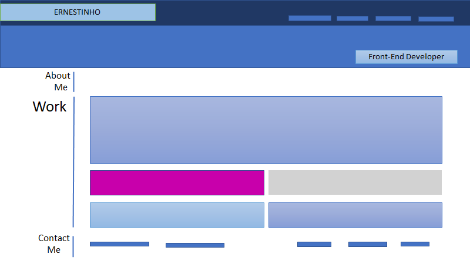

# Portfolio

This project showcases my skills in front-end web development.

The following tools are used in this project: Html, flexbox, media queries, and CSS variables.

## Functionality

- When the page is loaded the page presents my name, photo, and links to sections about me, my work, and how to contact me.
- Links - When one of the links in the navigation is clicked then the UI scrolls to the corresponding section
- Sections - each section contains titled images of my applications
- Sensitivity - application's image presented becomes larger in size than the others
- When images of the applications are clicked then the user is taken to that deployed application
- When the page is resized or viewed on various screens and devices then the layout is responsive and adapts to my viewport

## Mock-Up

The following animation shows the web application's appearance and functionality:

### Wire Frame

### Demo

Below is a demo of the completed portfolio.

